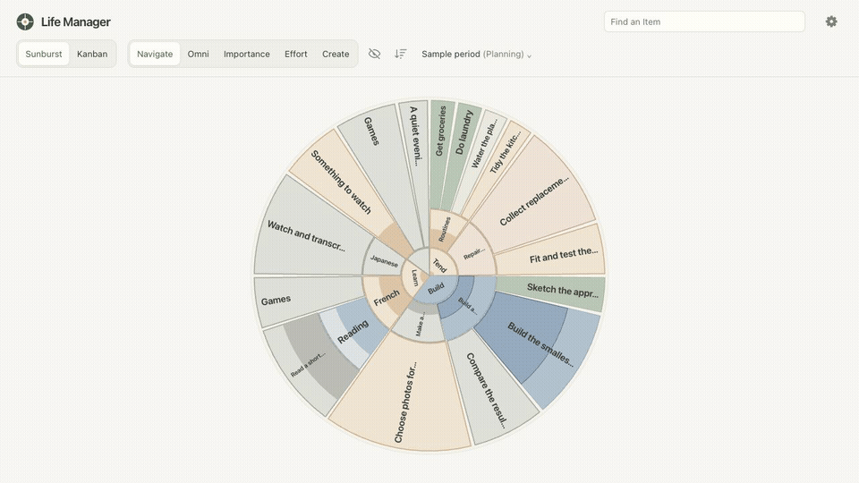
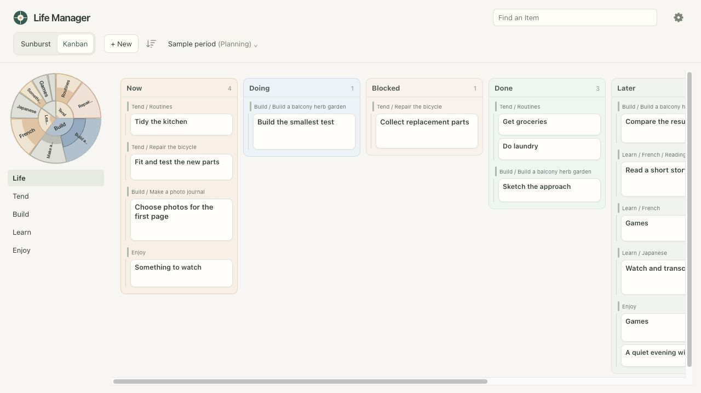
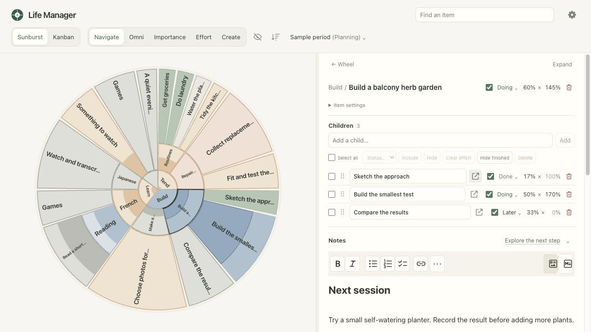

# Life Manager

**Notion-like notes and task boards meet a Goalscape-inspired map of your attention.**

Life Manager brings projects, routines, learning and leisure into one personal workspace. Keep the context you would put on a Notion page, give each pursuit a place in a visual hierarchy, and choose how much of your attention it deserves right now.

Use Outline to organise projects and next steps across the hierarchy, and the sunburst to balance attention. Switch to Kanban when you're ready to act. Return to your notes when you need to pick up where you left off.



## What you can do

- **See the whole picture.** Arrange areas, projects and tasks in a zoomable sunburst. Resize slices to express their relative importance.
- **Plan across branches.** Expand the Outline to edit inclusion, properties, allocation and effort in place. Add children anywhere, drag branches between parents with Undo, or select Items for bulk changes.
- **Keep today's choices manageable.** Hide inactive branches without losing their notes or next steps. Bring them back when your interests change.
- **Work from a familiar board.** Group cards by a single-choice property, drag them between its options, and sort temporarily by importance, effort or property order. Card size reflects intended attention.
- **Make the workspace yours.** Name your workspace, organise its top-level Items, and define properties with your own labels, colours and creation defaults.
- **Keep tasks and knowledge together.** Every Item has children and rich Markdown notes, with checklists, images, links, tables and direct source editing.
- **Reflect without a timer.** Record effort against your intention, including effort above 100%. For checklist-style projects, let completed children contribute automatically.
- **Preserve each planning period.** Capture Opening, Planned and Closing snapshots, including titles, hierarchy, notes, visibility, allocations and property configuration. Revisit a period as it was at the time.
- **Bring activities into your notes.** Optional widgets list local media or live Twitch follows; turn an interesting entry into an Item when you want to keep it.
- **Keep your workspace on your own machine.** Use desktop and phone browsers against one server. Your notes and history live in a local SQLite database, with JSON export available.

## Plan around the life you actually lead

A fresh workspace starts with four areas:

| Area | What belongs here |
| --- | --- |
| **Tend** | Routines, obligations and practical projects |
| **Build** | Things you want to make, experiment with or improve |
| **Learn** | Deliberate study and practice |
| **Enjoy** | Leisure, entertainment and downtime |

These are starting points: use Settings → Top-level Items to rename, add, reorder or remove them. The same Item can hold a short task, a long-running project or a page of ideas with children underneath it.

A slice's size means **intended share of attention**. Its fill means **effort spent relative to that intention in the current period**. Neither is a time estimate or an overall project-completion percentage. You can finish a productive session on an open-ended project without pretending the whole project is nearly done.

Click or tap any Item to open its details. Double-click on desktop to zoom into a branch. Right-click or long-press for a compact menu with inclusion, Move, Zoom in, and status choices. The center opens the focused Item; the ↑ control goes to its parent. **+ New** creates an Item in the current branch in Sunburst or Kanban. Outline has an Add Item action and an Add child action on every row. Desktop Omni mode also puts allocation, effort and creation controls directly on the wheel.

### Switch to execution

The Kanban board keeps the same hierarchy and focus. Related tasks stay grouped by their parent, while the small wheel and branch navigation help you choose what to work on.



The starting Status options use **Now** for work you intend to tackle, **Doing** while it's underway, and **Blocked** when something is in the way. **Done** records completion, **Later** keeps a possibility for reconsideration, **Skip** means it isn't relevant this period, and **Cut** means you've intentionally abandoned it.

Choose **Group by** to organise columns by another property, and **Color by** to colour cards and the wheel independently. Each property includes an unset choice. Right-click or long-press a card for the same compact actions menu as the wheel.

Parents with included children stay off the board so the actionable children take the space. A parent with no included children can remain visible as a placeholder for work you still need to define.

### Quickly narrow the view

**Filter** shows all property values as toggles. Switch off Done, Cut or Blocked to concentrate on available work. For triage, choose **None** beside Status and turn on its default or Unset. Combine that with a Project value to narrow the view further. Each toggle applies immediately; **All** restores a property and **Reset all** clears every filter.

Filters carry across Sunburst, Kanban and Outline and survive refresh, browser Back and app restarts. They are saved in this client's local storage; explicit filters in a link take precedence. They do not change dashboard inclusion or effort. Outline and the wheel retain ancestors for context. Clear filters before resizing importance on the wheel.

### Leave yourself a good place to resume

Open an Item to edit its children and notes together. Record a blocker, paste a useful link, or leave a few lines about the next experiment. Notes autosave, and Markdown source mode is available when you want direct control.



When it's time to reconsider your priorities, use the period menu to capture your plan or begin the next period. Rollover preserves the previous period and carries your current work forward; it does not automatically reset tasks.

Choose **Reset properties…** in the period menu to return effort and importance to Auto or bulk-set Status and other properties. Review the selected resets and affected Item counts before confirming; the reset includes hidden Items and descendants and preserves historical snapshots.

## Browser demo

[Try the interactive demo](https://lachlanstuart.com/life-manager/). The browser-only build lets you try the planner, boards, notes and snapshots with fictional sample projects. It stores changes in this browser only. **There is no data export, and browser storage can be cleared without warning: do not use the demo for anything you need to keep.** Local media, Twitch and agent launch need the self-hosted app below.

## macOS menu-bar app

On an Apple Silicon Mac, build a local desktop app from this checkout:

```sh
npm ci
npm run build:desktop
npm run desktop
```

Building requires Node.js 22.12 or newer and Xcode Command Line Tools. The resulting `release/Life Manager-darwin-arm64/Life Manager.app` includes its own runtime. Copy it to Applications if desired; running it does not require Node.js. This is a local, unsigned build with no automatic updates.

Choose **Local workspace** to create a workspace or select an existing data directory, or **Connect to server** to use an independently running Life Manager server. Stop servers from older versions before opening their data directory. New desktop workspaces default to `~/Library/Application Support/Life Manager/workspace/`; existing data is used in place, not moved or copied.

Life Manager stays in the menu bar. Its Dock icon appears while a workspace or connection-settings window is open, including when minimized, and disappears when all windows are closed or hidden. Closing the workspace window keeps the local server running. The menu offers **Open Life Manager**, **Open in Browser**, **Connection Settings**, and **Quit Life Manager**. Quit stops a server started by the app and leaves an independently running server alone.

Desktop and browser windows can use the same workspace simultaneously. Local hosting initially allows access only from this Mac. For remote access, use [Tailscale Serve](#use-it-on-your-phone) and leave **Allow access from other devices** disabled. Enabling that setting allows direct access on all IPv4 interfaces, including Wi-Fi; use it only for intentional sharing on a trusted LAN. The menu then lists addresses you can click to copy. Other devices need this Mac to remain awake. There is no sign-in, so do not expose the server directly to the public internet.

Rebuild and replace the app to update it, quitting the old app first. Your workspace stays outside the application bundle. See [desktop operation](docs/REFERENCE.md#desktop-operation) for logs and connection details.

## Install and try the standalone server

You'll need **Node.js 22.12 or newer**, npm and Git. Use the same Node version for installation and execution.

After switching Node versions in an existing checkout, run `npm rebuild better-sqlite3` before starting the server or running tests. SQLite uses a native module compiled for the Node version that installed it.

```sh
git clone https://github.com/LachlanStuart/life-manager.git
cd life-manager
npm ci
npm run build
npm run demo
```

Open **[localhost:4317](http://localhost:4317)**. The demo contains only fictional sample projects and stores your trial edits separately in `.demo-data/`.

To start your own workspace, stop the demo with **Ctrl+C**, then run:

```sh
npm start
```

On macOS this uses `~/Library/Application Support/Life Manager/workspace/`, the same default as the desktop app. Other platforms use `.data/` in the checkout. A new workspace starts with the four initial areas and no sample projects. Stop the server with Ctrl+C when you're finished.

If upgrading a macOS checkout with an existing `.data/` workspace, stop its server and move the entire directory to the new location, or set `LIFE_MANAGER_DATA_DIR` to continue using it in place. Startup reports an existing checkout-local workspace rather than silently creating a new one. Check that the destination does not already contain another workspace before moving data.

## Configure your workspace

Under **Settings → Workspace and properties**, edit the workspace name and add single-choice properties. Give each property ordered options, colours, an unset label, and a default for new Items. Defaults never fill existing Items retroactively. Edit an Item’s values under **Properties**, or use the inline and child bulk pickers.

The optional **Lifecycle property** determines calculated effort: Completed gives leaves 100%; No calculated effort gives an Item 0% even when it has children. Manual effort overrides either behaviour. Status has this role initially; colouring and grouping by another property do not change it.

Settings also contains top-level Items, saved agent prompts and sunburst display preferences. Workspace configuration, Items and history are saved on the server. Display preferences such as label sizes and padding are saved in that browser.

| Environment variable | Default | Purpose |
| --- | --- | --- |
| `PORT` | `4317` | Choose the server port |
| `HOST` | `127.0.0.1` | Listen address; local access only by default. `0.0.0.0` explicitly enables access on all IPv4 interfaces, including Wi-Fi |
| `LIFE_MANAGER_DATA_DIR` | macOS: `~/Library/Application Support/Life Manager/workspace/`; other platforms: `.data/` | Choose where your personal workspace is stored; the demo always uses `.demo-data/` |

The server accepts connections only from this computer by default. To explicitly enable direct access from a trusted LAN on macOS or Linux:

```sh
HOST=0.0.0.0 npm start
```

### Use it on your phone

Keep the server bound to `127.0.0.1` and use [Tailscale Serve](https://tailscale.com/docs/features/tailscale-serve) for access through your tailnet. With Tailscale connected on the host and phone, start Life Manager and run this on the host:

```sh
tailscale serve --bg http://127.0.0.1:4317
```

Follow any setup link Tailscale provides, then open the HTTPS address it reports on your phone. If you use a different Life Manager port, substitute it above. For desktop hosting, leave **Allow access from other devices** disabled and choose a fixed server port. A desktop app attached to an independently running server uses that server's listening settings.

Serve makes the local service available through Tailscale without opening Life Manager's port to the surrounding Wi-Fi network. Use Serve, not Funnel, which enables public internet access. Restrict access with your tailnet's access rules: anyone allowed to reach Life Manager has full access to its workspace and server-side actions.

The phone uses the same workspace, and the host must be awake with the server running. This is an ordinary online web app; offline editing is not supported.

**There is no sign-in screen or multi-user isolation. Keep the server on a trusted private network and do not expose it directly to the public internet.**

### Optional activity widgets and agent prompts

Add widgets from the Notes editor and edit their configuration in Markdown:

- **Local videos:** choose an absolute media-directory path and optional folder exclusions. The widget lists immediate files and folders on the server; it does not play or host videos.
- **Twitch:** supply your own public Twitch Client ID, connect your account, and group followed channels however you like. No client secret is needed.
- **Agent prompts:** save reusable prompts that include an Item's title, link and ID. The Notes action shows the full prompt in a copyable dialog by default. Settings → Prompts → Prompt handling can switch this client to Codex drafts or T3 Code. T3 copies the prompt and opens a blank conversation for you to paste into; T3 must already be running. Browser clients launch it on the server, while the Electron app launches it locally. If detection fails, enter its app bundle or CLI executable in the automatically saved T3 Code location field.

See the [configuration reference](docs/REFERENCE.md#widgets) for widget examples and Twitch setup, or [agent prompts](docs/REFERENCE.md#agent-prompts) for the integration details. None of these integrations is required for ordinary planning and note-taking.

### Back up your data

Back up the **whole data directory**, including the SQLite database and `attachments/`. Stop the server before making a simple folder copy. For backups while the app is running, use SQLite's backup facilities and preserve the attachments alongside the database.

[Download a JSON export](http://localhost:4317/api/export) from a server on the default local port, or use `/api/export` on your server's address. JSON exports include current and historical records, but do not replace an attachments backup.

Keep data directories and authorisation tokens private. [Storage details](docs/REFERENCE.md#storage) describe what is saved.

## Development and feedback

Life Manager is early, self-hosted software for a single personal workspace. It has no built-in reminders, automatic recurrence or time tracking. Routine review and period rollover are deliberate actions.

For a source update, stop the server, pull the changes, then run `npm ci`, `npm run build` and `npm start` again. Back up your workspace before updating.

To check changes locally:

```sh
npm run verify
```

This runs the TypeScript checks, tests and production build. `npm run dev` watches server changes; rebuild after editing the frontend.

[Report a bug or suggest an improvement](https://github.com/LachlanStuart/life-manager/issues). For integrations and contributors, the [technical reference](docs/REFERENCE.md), [product model](PRD.md) and [agent API guide](skills/life-manager/SKILL.md) describe the existing behaviour.

Inspired by Notion's combination of notes and task organisation and Goalscape's visual approach to priorities. Life Manager is an independent project.

## License

[MIT](LICENSE).
